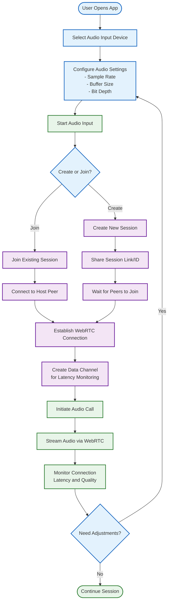

# DAW Collaboration Tool

A web-based peer-to-peer real-time audio collaboration tool that allows musicians to collaborate remotely using their Digital Audio Workstations (DAWs).

## Overview

This application enables musicians to collaborate remotely by creating a peer-to-peer connection for real-time audio streaming. Using WebRTC technology through the PeerJS library, it establishes low-latency audio connections between collaborators, making remote music production and jamming possible.

## Features

- **Real-time audio streaming** between peers over WebRTC with minimal latency
- **Multi-user support** for collaborative sessions with multiple musicians
- **Configurable audio settings** (sample rate, buffer size, bit depth)
- **Visual audio level meters** for monitoring local and remote streams
- **Real-time latency and jitter monitoring** with color-coded quality indicators
- **Simple session sharing** via URL links
- **Browser-based solution** with no software installation required
- **Automated connection management** using PeerJS
- **Advanced debugging tools** for troubleshooting audio issues

## Step-by-Step Signal Flow with Latency Identification



### Latency Analysis in the Audio Collaboration Pipeline

The DAW Collaboration Tool minimizes latency where possible, but several unavoidable latency points exist:

1. **Audio Driver Buffer** (10-100ms): The virtual audio device adds latency based on buffer size settings
   
2. **Browser Buffer Size** (5-50ms): Web Audio API processing creates latency proportional to the chosen buffer size
   
3. **Signaling Latency** (50-500ms): One-time connection setup delay through PeerJS server
   
4. **Network Latency & Jitter** (20-200ms): The most significant variable factor, depends on:
   - Internet connection quality
   - Geographic distance between peers
   - Network congestion
   - Route efficiency
   
5. **Decoding Delay** (5-20ms): Time required to decode the received audio stream
   
6. **Output Buffer** (5-30ms): Final playback buffer adds small additional latency

**Total End-to-End Latency Range**: ~45-900ms (under typical conditions: 80-150ms)

The application's latency monitor continuously analyzes the connection quality and displays real-time metrics with color-coded indicators:
- **Green**: Good (<50ms round-trip, <15ms jitter)
- **Amber**: Moderate (<100ms round-trip, <30ms jitter)
- **Red**: Poor (≥100ms round-trip or ≥30ms jitter)

## How It Works

1. **Audio Routing**: Musicians route their DAW's audio output to a virtual audio device (like Loopback, BlackHole, VB-Cable, etc.)
2. **Browser Capture**: The application captures this audio through the browser's Web Audio API
3. **Peer Connection**: When a session is created, a unique session ID is generated through PeerJS
4. **Audio Streaming**: WebRTC establishes a direct peer-to-peer connection for low-latency audio streaming
5. **Real-time Monitoring**: Audio levels and network performance (latency/jitter) are constantly monitored
6. **Playback**: Incoming audio from remote peers is played through the local computer's audio output

## Technical Stack

- **WebRTC**: Core technology for peer-to-peer audio streaming
- **PeerJS**: Simplifies WebRTC connection establishment and session management
- **Web Audio API**: Handles audio capturing, processing, and visualization
- **JavaScript Modules**: Organized code structure for maintainability
- **HTML/CSS**: Responsive UI designed for musicians' workflow

## Setup and Usage

### Prerequisites

- A modern web browser with WebRTC support (Chrome, Firefox, Edge, Safari)
- Audio routing software to send your DAW's output to your system's input:
  - **macOS**: Loopback, BlackHole, Soundflower
  - **Windows**: VB-Cable, JACK Audio, ASIO Link Pro
  - **Linux**: JACK Audio, PulseAudio

### Running the Application

1. Clone or download this repository
2. Open the `index.html` file in your web browser
3. Configure audio settings based on your DAW's configuration
4. Click "Start Audio Input" to initialize audio capture
5. Create a new session or join an existing one using a Session ID
6. Share your Session ID with collaborators or use their ID to join

### DAW Setup

1. Configure your DAW to send its output to your system's input using audio routing software
2. Set your DAW's sample rate and buffer size to match the settings in the application
3. Create a separate track in your DAW to monitor the incoming audio from your collaborators

## Performance Considerations

For the best collaboration experience:

- Use a wired internet connection when possible
- Lower buffer sizes provide less latency but may introduce audio glitches
- Higher buffer sizes provide more stability but increase latency
- Latency values below 50ms are considered good for real-time collaboration
- Jitter values below 15ms indicate a stable connection

## Troubleshooting

The application includes several built-in tools for diagnosing and fixing audio issues:

- **Debug Panel** (Alt+D or visible debug button): Advanced tools for fixing audio and connection issues
- **Audio Signal Verification**: Automatic detection of audio signal problems
- **Connection Quality Monitoring**: Visual indicators of network performance
- **Browser Console Logging**: Detailed diagnostic information

## Project Structure

```
daw-collaboration-app/
├── index.html                # Main HTML file
├── css/
│   └── styles.css            # Styles for the application
├── js/
│   ├── main.js               # Main application logic
│   ├── audio-manager.js      # Audio capture and processing
│   ├── peer-manager.js       # PeerJS connection handling
│   ├── ui-controller.js      # UI updates and event handling
│   ├── latency-monitor.js    # Connection quality monitoring
│   └── utils.js              # Utility functions
└── README.md                 # Project documentation
```

## Limitations

- Browser security restrictions require HTTPS for accessing audio devices in production environments
- Latency is dependent on network conditions and cannot match physical in-person collaboration
- Audio quality may be affected by bandwidth limitations
- Browser autoplay policies may require user interaction before audio can play

## License

This project is open source and available under the MIT License.

## Acknowledgements

- [PeerJS](https://peerjs.com/) for simplifying WebRTC connections
- [Web Audio API](https://developer.mozilla.org/en-US/docs/Web/API/Web_Audio_API) for audio processing capabilities